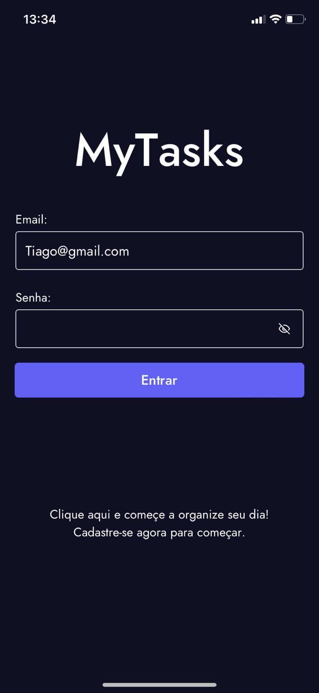
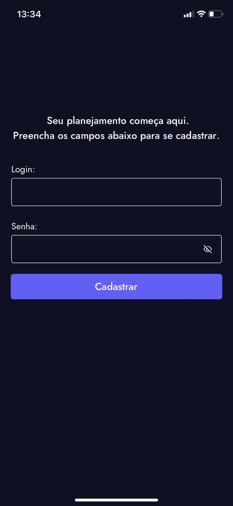
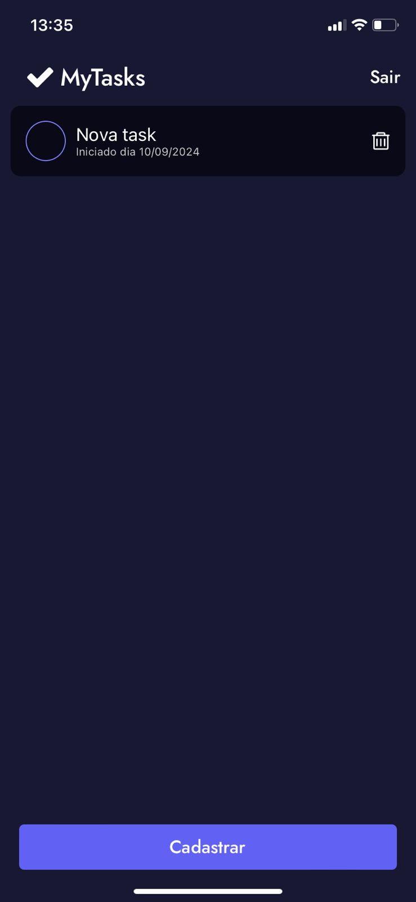
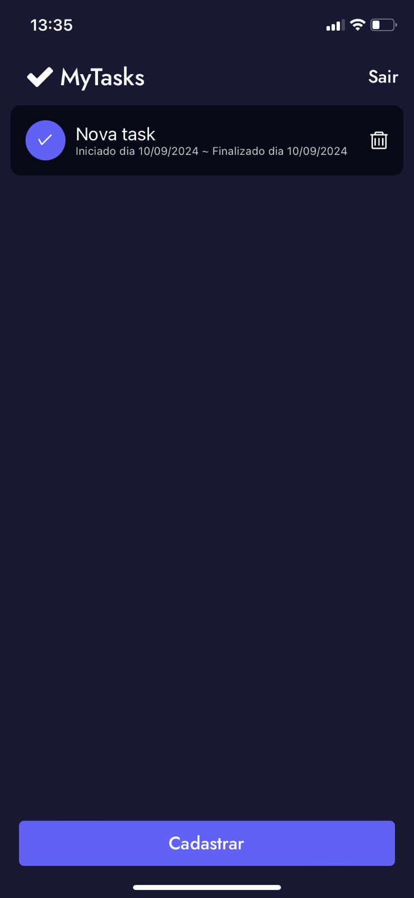
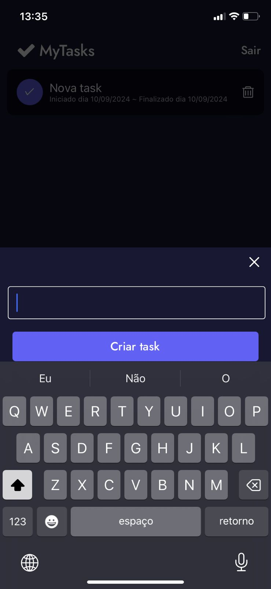

# Todo List App

## 📋 Descrição

O **Todo List App** é uma aplicação mobile desenvolvida em **React Native**, projetada para ajudar os usuários a organizar suas tarefas diárias. Ele permite criar e gerenciar tarefas, visualizar as tarefas registradas e marcar como concluídas. O app também oferece funcionalidades de login e registro de usuário, garantindo que as tarefas sejam exclusivas para cada usuário.

## 🚀 Funcionalidades

- **Registro de usuário**: Permite novos usuários se registrarem no sistema.
- **Login de usuário**: Login com credenciais para acessar a lista de tarefas.
- **Adicionar tarefas**: Crie tarefas com título e data de início.
- **Visualizar tarefas**: Veja todas as suas tarefas na tela inicial.
- **Concluir tarefas**: Marque tarefas como concluídas.
- **Armazenamento persistente**: As tarefas são salvas localmente com AsyncStorage.
- **Interface amigável**: Utiliza o **Gluestack UI** para uma interface limpa e responsiva.

## 🛠️ Tecnologias

- **React Native**: Framework principal para o desenvolvimento mobile.
- **AsyncStorage**: Para persistência de dados localmente.
- **Gluestack UI**: Biblioteca de componentes UI.
- **Expo**: Ferramenta para facilitar o desenvolvimento e build do app.

## 🔧 Instalação e Execução

```bash
1.Clone este repositório:
git clone https://github.com/Agotsilv/todo-list-react-native.git

2.Acesse o diretório do projeto:
cd todo-list-react-native

3.Instale as dependências:
npm install

4.Execute o projeto:
expo start
```

## 📱 Funcionalidades futuras

- Edição de tarefas.
- Filtrar tarefas por status (concluídas ou pendentes).

## 📷 Imagens

<h1 align="center">
  <div style="display: flex; flex-direction: row; align: center;" align="center">
    
    
    
    
    
    
  <div>
</h1>
